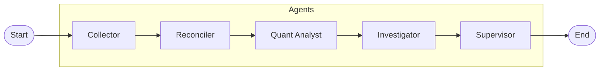
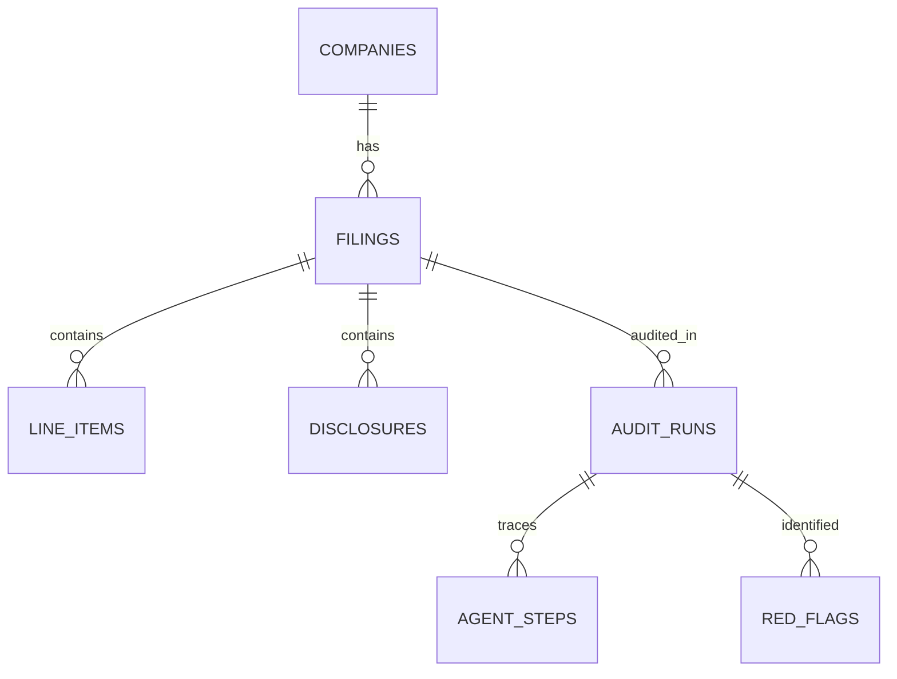

# AuditChain Architecture 🏗️

AuditChain is designed as a **directed acyclic graph (DAG)** of specialized agents. This document explains the technical rationale behind the pipeline, the state management, and the communication protocols.

## 1. Overview
AuditChain solves the forensic audit problem by decomposing a complex task (identifying fraud in a 10-K) into discrete, verifiable steps. Instead of asking a single LLM to "find fraud," we've built a system where agents check specific dimensions (math, quant models, qualitative RAG) and a **Supervisor** consolidates the evidence.

## 2. The Multi-Agent Pipeline (LangGraph)
The core of the system is built with **LangGraph**. The workflow follows a strict sequential-then-consolidated pattern:



### Why a Graph?
- **State Persistence**: The graph maintains an `AuditState` that persists throughout the run.
- **Node Specialization**: Each node can use a different LLM (e.g., `gpt-4o-mini` for speed/cost in tool-heavy nodes, `gpt-4o` for the final report).
- **Control Flow**: We use conditional edges to handle failures (though the current production flow is primarily linear for high reliability).

## 3. State Management
We use a shared `AuditState` typed via Pydantic and `typing.Annotated`.

```python
class AuditState(TypedDict):
    audit_run_id: str
    company_cik: str
    red_flags: Annotated[list[RedFlag], operator.add]  # List appends automatically
    current_phase: AuditPhase
    # ... other fields
```

The `operator.add` reducer is crucial: it allows any agent to "raise a flag" at any time, and the graph automatically merges these findings into the global state without losing data from previous agents.

## 4. Agent Communication: The "Submit Tool" Pattern
We avoid fragile markdown parsing. Every agent is equipped with a specific **Submit Tool** (e.g., `submit_reconciliation`). 

1. Agent performs work using internal tools (e.g., `search_disclosures`).
2. Agent reaches a conclusion.
3. Agent calls `submit_x(data: PydanticModel)`.
4. The node function catches this tool call, validates the data, and returns it to the graph.

This ensures that the **Supervisor** always receives structured, validated JSON data, not a wall of text.

## 5. RAG Architecture
The **Investigator Agent** uses Retrieval-Augmented Generation to analyze qualitative disclosures (MD&A, Risk Factors).

- **Database**: PostgreSQL with `pgvector`.
- **Embedding Model**: `text-embedding-3-small` (1536 dimensions).
- **Strategy**: Disclosures are chunked by section. The agent can filter searches by specific filing sections to reduce noise and improve relevance.

## 6. Deterministic Risk Scoring
AuditChain does not ask the AI "What is the risk from 1 to 100?". This would lead to inconsistent hallucinated numbers.

Instead, we use a **deterministic formula** based on the severity of the `red_flags` accumulated in the state:
- **CRITICAL**: 25 points
- **HIGH**: 15 points
- **MEDIUM**: 8 points
- **LOW**: 3 points
- **INFO**: 1 point

The final `risk_score` is capped at 100. This makes the system **auditworthy**: you can trace exactly why a score is 60/100 by looking at the specific flags raised.

## 7. Real-time Streaming (SSE)
To provide a premium user experience, we stream every agent thought and tool call to the frontend.

- **Protocol**: Server-Sent Events (SSE).
- **Infrastructure**: An in-memory `Publisher` using `asyncio.Queue` per audit run.
- **Frontend**: A custom React hook `useAuditStream` handles the connection, reconnects automatically, and manages the local state machine for the pipeline visualizer.

## 8. Database Schema
AuditChain uses a relational schema to maintain the full history of audits and agent steps.



- **`audit_runs`**: Stores the high-level result and risk score.
- **`agent_steps`**: A full trace of every LLM interaction (tokens, latency, tool calls).
- **`red_flags`**: The specific findings raised by specialized agents.

## 9. Frontend Architecture
The frontend is a **Next.js 15** application using the **App Router**.

- **Server Components**: Used for the dashboard shell and historical audit listing.
- **Client Components**: Used for the live audit page to manage the SSE connection and Framer Motion animations.
- **Design System**: A custom implementation of **shadcn/ui** with a neutral color palette, generous spacing, and subtle micro-animations.
